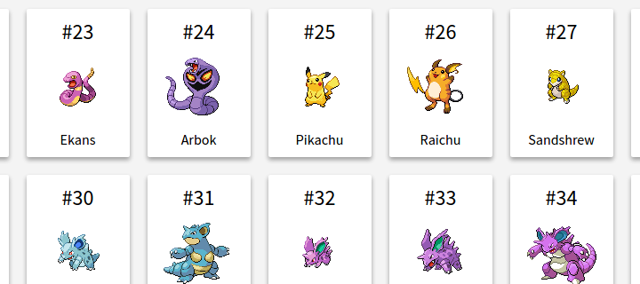

# Angular Pokemon

Your goal is to develop an Angular app for browsing Pokémons. In other words, your own [Pokédex](https://www.pokemon.com/us/pokedex/).



## Interacting with the Pokeapi

Get your pokémon data from the [Pokeapi](http://pokeapi.salestock.net/). You can start by querying the [endpoint that lists 150 pokémons]([this one](http://pokeapi.salestock.net/api/v2/pokemon/?limit=151)).

This API has a limit of 300 requests per day per IP, so as it says in the docs try to cache the result (save it to a JSON file) otherwise your IP address will be blocked.

You may have problems with the images, so it’s a good idea to get a complete set for the pokémon list and then load them locally.

## Getting started

1. Learn how to make HTTP requests to the [Pokeapi](http://pokeapi.salestock.net/), following the [docs for V2](http://pokeapi.salestock.net/docsv2/).
2. Collect all the relevant resources you need (Pokémon, description, and sprite).

## Commit message conventions

Start using [commit message conventions](https://github.com/angular/angular/blob/master/CONTRIBUTING.md#commit) in your project, as it will make you a better programmer.

Here’s an example of what it looks like:

```
feat: clicking on a pokemon opens the details page
```

You’ll never again be tempted to include a bug fix and a feature in the same commit.

Also, it makes it easier for people to collaborate, by allowing them to explore a more structured commit history.

It’s a good idea to use a tool (like [Commitizen](http://commitizen.github.io/cz-cli/)) to support and automate this process.

## Tasks

Follow best practices such as commenting your code, committing often and being mindful of indentation. When creating a new project with Angular CLI, a linter is automatically set up for you. Make sure to lint your code before committing, as this will help your work look professional.

1. Run `ng new pokemon --directory client` to set up a new Angular app in the `./client` folder using the Angular CLI.
2. With the help of the CLI, create a `Pokemon` model. This will represent a movie in our app.
3. Create a service named `ApiClient` (find the correct command to use in the CLI). This service exposes some methods that make HTTP requests to the movied server using `fetch`. Develop the following methods:
   - `gottaCatchEmAll()` – Get the list of all the pokémons
   - `catchOne(pokemonId)` – Get info about a single pokémon by ID
4. On the `/` endpoint (i.e. home), show a `Dashboard` component. This component will show the list of pokémons. You should display every pokémon as a card, following the template in the image above.
5. In the top se lion of your window, show a `Navbar` component that allows to search for pokémons by name and re-render the dashboard with the result.
6. When clicking on a pokémon card, the browser should go into a `pokemon/:pokeId` path, rendering a `Single Pokemon View` component that shows the details for that pokémon.

## Extra credits

Replace the Pokeapi. Create a server with Koa and Mongoose that stores the list of pokémons in its database. It should include two routes:

- `GET /pokemons` for listing the pokémons
- `GET /pokemons/:id` for retrieving an specific pokémon
- `POST /pokemons` for creating a new pokémon.
- Create a form in the client application using [Angular Reactive Forms](https://angular.io/guide/reactive-forms) that lets the user create a new pokémon using the previous endpoint.
